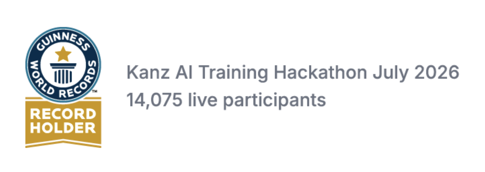

# BizStart Simulator

A business plan and financial model generator built for the **Kanz AI Hackathon** (Vision 2030).


🏆 **Guinness World Records™ — Kanz AI Training Hackathon, July 2026** (14,075 live participants)



---

## What it does

BizStart Simulator helps aspiring entrepreneurs turn a business idea into a realistic, visual financial model in minutes — no spreadsheet skills required. Enter your business details, and it generates projections, cost/revenue breakdowns, and interactive charts you can use to plan or pitch.

<!-- Add a GIF or screenshot here once you've recorded one, e.g.: -->
 

**Live demo:** [BizStart Simulator on Replit](https://replit.com/@zainabh456/BizStart-Simulator)
**Hackathon portfolio:** [Kanz AI Hackathon submission](https://try.ka.nz/ai/zainabalmahal)

### Features

**Core financial modeling**
- Input a business idea and get an auto-generated financial model
- Interactive charts (built with Recharts) visualizing revenue, costs, and growth projections

**AI Reality Check**
- Analyzes live budget numbers against industry benchmarks for beginner businesses, on demand via an "Analyze My Plan" button
- Live snapshot bar showing exactly what's being analyzed (expenses, revenue, capital, marketing %)
- Conditional insight cards that appear only when a risk threshold is breached:
  - **Low Visibility Risk** — marketing spend below 8% of total expenses
  - **Runway Warning** — starting capital covers less than 4 months of operating expenses
  - **Unrealistic Margin Check** — profit margin above 60%, flagging likely uncounted costs
  - **All Clear** card when none of the above are triggered
- Auto-generated 3-step action checklist with advice that adapts to the user's actual numbers

**Bilingual support (English/Arabic)**
- One-click EN/AR toggle in the navigation header
- Full RTL layout mirroring for Arabic (via `dir="rtl"` and Tailwind logical properties)
- All UI text — tabs, headers, tooltips, insight cards, checklist — translated through a centralized translation system
- Numeric inputs stay left-to-right in both languages so currency figures read correctly
- Arabic-compatible typography (Cairo font) loads automatically in RTL mode
- Language preference persists across page refreshes

**Premium tier (mock Stripe checkout)**
- Premium call-out card with a simulated checkout flow (idle → processing → unlocked)
- Unlocked tier reveals 4 advanced insights (Pricing Power, Marketing ROI, Scale Readiness, Cash Flow Risk Window) plus a 90-day cash flow projection
- Downloadable strategic report (.txt) generated client-side with the user's real numbers, a compliance checklist, and a 90-day roadmap

**General**
- Clean, responsive UI styled with Tailwind CSS
- Fully typed with TypeScript for reliability and maintainability

### Background
This project was built for the **Kanz AI Training Hackathon (July 2026)**, part of Kanz's Vision 2030-aligned initiative to showcase AI-powered tools. The event set a **Guinness World Record™** for the largest live AI training hackathon, with 14,075 participants. Unlike generic spreadsheet templates or static business plan generators, BizStart Simulator gives founders an interactive, visual way to stress-test their numbers before committing to a plan.

---

## How it was built

**Tech stack:** React, TypeScript, Tailwind CSS, Recharts

### Requirements
- Node.js (v18 or higher recommended)
- npm (comes with Node.js)

### Installation
```bash
# Clone the repository
git clone https://github.com/ZainabHM278/bizstart-simulator.git
cd bizstart-simulator

# Install dependencies
npm install

# Start the development server
npm run dev
```
The app will be available at `http://localhost:5173` (or whichever port your dev server prints in the terminal).

### Building for production
```bash
npm run build
```

---

## Usage

1. Launch the app (`npm run dev` or visit the [live demo](https://replit.com/@zainabh456/BizStart-Simulator)).
2. Enter your business idea and basic details (e.g. industry, initial investment, expected pricing).
3. BizStart Simulator generates a financial model with interactive charts showing projected revenue, costs, and break-even timeline.
4. Adjust inputs to see how changes affect your projections in real time.

<!-- Add a code snippet or screenshot of a sample input/output here if useful -->

---

## Why this project exists

Many first-time entrepreneurs — especially students and early-career founders — struggle to translate a business idea into numbers they can actually plan around. Spreadsheet templates are intimidating, and most existing tools are either too generic or too complex. BizStart Simulator was built to lower that barrier: a simple, visual, guided way to model a business plan, built specifically for the Kanz AI Hackathon's mission of supporting Vision 2030-aligned innovation.

---

## Roadmap
- [ ] Add industry-specific selection, with tailored advice based on market conditions and business type
- [ ] Incorporate insights from public data on past businesses to improve model accuracy and recommendations
- [ ] Add downloadable PDF export of generated business plans (in addition to the current .txt strategic report)
- [ ] Support multiple currency and market presets

## Support
For questions or issues, please open an [issue](https://github.com/ZainabHM278/bizstart-simulator/issues) on this repository.

## Contributing
This is a hackathon submission and not currently open to external contributions, but feedback and suggestions are welcome via GitHub issues.

## Author
**Zainab Al-Mahal (ZainabHM278)**
GitHub: [github.com/ZainabHM278](https://github.com/ZainabHM278)

## License
This project is licensed under the MIT License — see the [LICENSE](./LICENSE) file for details.

## Project Status
Actively maintained as part of an ongoing hackathon submission (Kanz AI Hackathon). Open to iteration and improvement post-submission.
